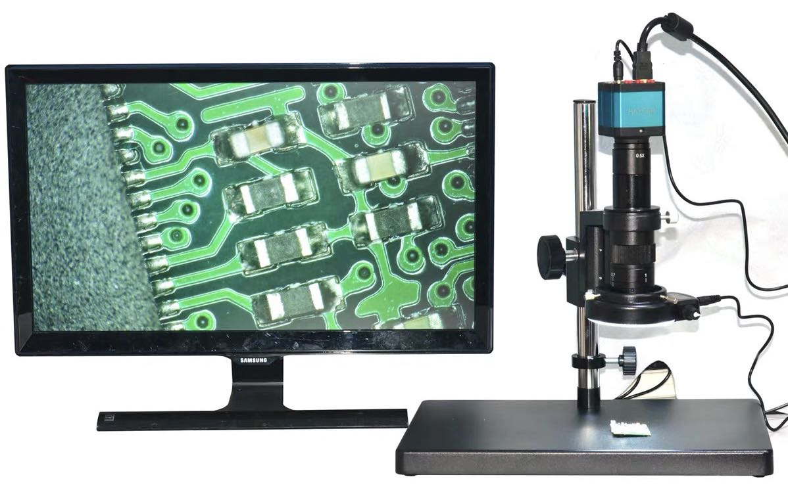
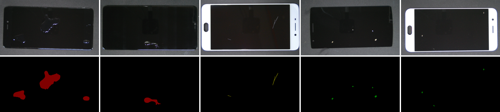

# MSD
Mobile phone screen surface defect segmentation dataset.<br/>
This dataset contains 3 types of surface defects: Oil, Scratch and Stain. It consists of 1200 images and 400 images for each defects. The defects are made by ourselves. The images are collected by industrial camera and the resolution is 1920×1080. The dataset is randomly divided into train:val:test=6:2:2. The dataset format is PASCAL VOC.<br/>
The dataset is built and presented by Jian Zhang, Miaoju Ban (Open Lab on Human Robot Interaction, Peking University). <br/>

Image Capture<br/>


Samples<br/>


## Download
||Link 1|Link 2|
| ------ | ------ | ------ |
| MSD.zip (1.57GB) | [OneDrive](https://1drv.ms/u/s!Ao8h0xonX6XKa5HKfEqXQHr7qm4?e=STifJf) | [Baidu Disk](https://pan.baidu.com/s/13sgK92DcmAbj03HY7kkCPQ?pwd=02e8)|
| good.zip (27.7MB) | [OneDrive](https://1drv.ms/u/s!Ao8h0xonX6XKcJ7zk0I80T6Bgis?e=9IrRaH) | - |
| Visualiztion.zip (79.0MB) | [OneDrive](https://1drv.ms/u/s!Ao8h0xonX6XKcDD3wJjyvJzl_sE?e=yriUQ9) | [Baidu Disk](https://pan.baidu.com/s/107RYurRo_vS9rC46BuVmOQ?pwd=tc2v) |

good.zip: We also provide 20 extra non-defective images which can be used for unsupervised setting.<br/>
Visualiztion.zip: This file is solely for visualization purposes, used to display the masks on the original images.

## Citation
If you find this work is helpful in your research, please cite:
````
@inproceedings{zhang2022fdsnet,
  title={FDSNeT: An Accurate Real-Time Surface Defect Segmentation Network},
  author={Zhang, Jian and Ding, Runwei and Ban, Miaoju and Guo, Tianyu},
  booktitle={ICASSP 2022-2022 IEEE International Conference on Acoustics, Speech and Signal Processing (ICASSP)},
  pages={3803--3807},
  year={2022},
  organization={IEEE}
}
````
## Related work
**VisA** ([repo](https://github.com/amazon-science/spot-diff))<br/>
**GoodsAD** ([repo](https://github.com/jianzhang96/GoodsAD))<br/>
**MVTec AD** ([website](https://www.mvtec.com/company/research/datasets), [paper](https://openaccess.thecvf.com/content_CVPR_2019/papers/Bergmann_MVTec_AD_--_A_Comprehensive_Real-World_Dataset_for_Unsupervised_Anomaly_CVPR_2019_paper.pdf))<br/>
**MPDD** ([paper](https://arxiv.org/pdf/2104.10036))<br/>
**DAGM** ([website](https://conferences.mpi-inf.mpg.de/dagm/2007/prizes.html))<br/>
**NEU surface defect database** ([website](http://faculty.neu.edu.cn/songkechen/zh_CN/zhym/263269/list/index.htm))
